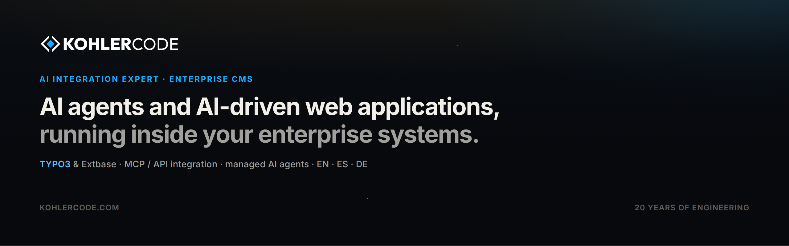

  

**KohlerCode is an AI integration agency.** We build and manage AI agents and AI-driven web applications for medium and large businesses — and we keep them running. Twenty years of engineering, one rule: technology has to earn its place.

## What we do

- **AI agent integration & managed AI agents** — assistants with controlled tool access to your own systems, plus the monitoring and maintenance that keeps them reliable after launch.
- **AI-driven web applications** — applications where the AI does real work inside your data and processes, not a chat widget bolted onto a website.
- **Enterprise CMS: TYPO3 & KocoDesk** — design, development, backend modules and migrations. Extbase / Fluid, TYPO3 12.4 through 14.1, PHP 8.0+.
- **Integration layer** — MCP servers, REST / API work, and the plumbing between language models and the systems you already run.
- **Multilingual delivery** — EN / ES / DE for the US, LATAM and DACH markets, including hosting, maintenance and migration.

## Open source

TYPO3 extensions I maintain and publish for the community — 7 published extensions, **47,433 downloads** (Extension Repository figures, September 2026).

| Extension | What it does | Downloads |
| --- | --- | --- |
| [slug](https://extensions.typo3.org/extension/slug) | Backend module for managing URL slugs across pages and records — built for SEO, bulk operations and editorial speed. | 26,955 |
| [ce_timeline](https://extensions.typo3.org/extension/ce_timeline) | Timeline content element: flexible, visually engaging timelines in the frontend. | 12,222 |
| [showcase](https://extensions.typo3.org/extension/showcase) | Dynamic portfolios, galleries and presentations for structured, repeatable showcases. | 3,567 |
| [faicon](https://extensions.typo3.org/extension/faicon) | Font Awesome icons as a page-property field, ready to use in Fluid templates. | 2,416 |
| [ce_counter](https://extensions.typo3.org/extension/ce_counter) | Counter content element for TYPO3 CMS. | 1,725 |
| [content_blocks_bootstrap](https://extensions.typo3.org/extension/content_blocks_bootstrap) | A collection of content blocks for the Bootstrap framework, built on `content_blocks`. | 351 |
| [btc](https://extensions.typo3.org/extension/btc) | Extbase plugins for live cryptocurrency prices and market data. | 197 |

Newer AI work lives on GitHub: [`agents`](https://github.com/kohlercode/agents) puts AI chat with tool calling inside the TYPO3 backend — assistants that answer questions, draft content and act on the site through controlled tool calls, with unlimited developer-defined tools. Extension Repository release pending.

If these saved you time: [kohlercode.com/donate](https://kohlercode.com/donate) funds open-source work only.

## Stack

  

TYPO3 & Extbase · PHP · MySQL & MariaDB · JavaScript / TypeScript · Sass & Bootstrap · Docker · Linux · Nginx · Redis · MCP server & API integration

## Work with us

- **Book a free consultation** — <https://calendar.app.google/3GGbJB9TQu4zv2y39>
- **Website** — <https://kohlercode.com>
- **Email** — hello@kohlercode.com
- **WhatsApp / Phone (Panama)** — +507 6921-8234
- **LinkedIn** — <https://www.linkedin.com/in/koehlersimon/>
- **YouTube** — <https://www.youtube.com/@kohlercode>
- **X** — <https://x.com/koehlersimon>

KohlerCode LLC · Panama · English · Español · Deutsch
